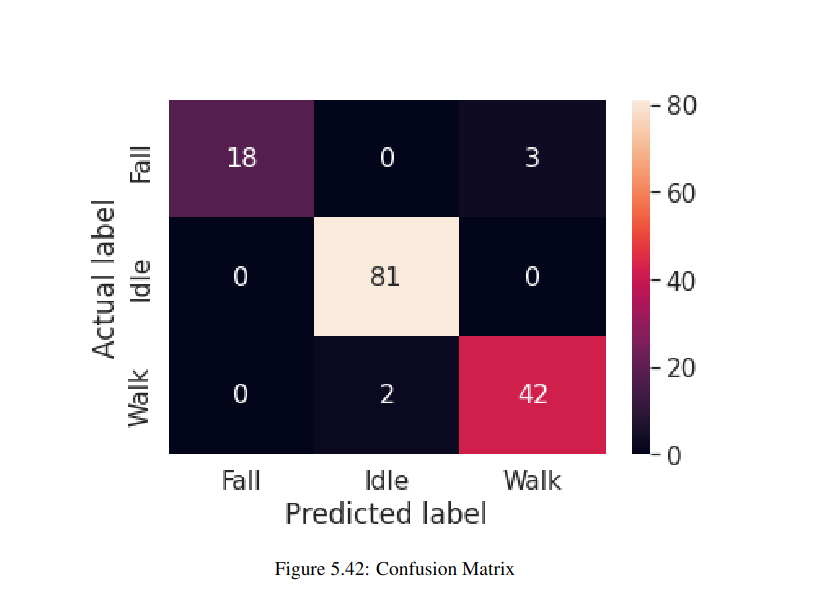

# FallDetection
- Detect falls using the 6-axis IMU sensor. 
- Send emergency messages to registered numbers in case of a fall. 
- A simple machine learning model capable of detecting falls and non-fall motions based on IMU sensor readings. 
- Enable the user to manually trigger emergency notifications with the press of a button.

## Dataset

For **Activities of Daily Life** the following activities were recorded:  
Standing, Standing to sitting, Jumping, Walking, Climbing up the stairs, Climbing down the stairs, Bending forward (approx. < 90 degrees), Bending forward deeply (approx. >= 90 degrees), Sleeping on the left side, Sleeping on the right side 

For **Falls**, the following scenarios were recorded:  
Falling forward, Falling backward, Falling to the right, Falling to the left

The data collected were simulated by 3 people. And in total ~600 samples were collected.

### Hardware Description
- MPU 6050, a Inertial Measurement Unit(IMU) was used, with breakout board GY-521.
- Microcontroller Raspberry Pi Pico was used for data collection, inference and to communicate with GSM.  
- SIM900A GSM Module for GPRS/GSM communication to send emergency notifications to registered numbers.
- 9V Battery to operate the device.
- LM2596-NR, buck converter for constant 5V operating voltage.
- Supporting hardware components such as a Matrix board, connectors, and casing. 
- KiCad, an open-source software suite used for schematic diagrams and design of electronic hardware.

### Software Description
We trained the model on 500 3 second internal of data consisting of 3 classes(fall, idle and walk). We then fed the input sequence through layers of convolutional neural network, (CNN) and the output was fed into a LSTM. The model was fed an input sequence of 3 seconds(with 10 samples per second) and was used to classify 3 different everyday motions and fall. The following validation results were obtained.  

TODO: Write a readme, clean up and organize the repo
#### Random stuff i forgot to add/do
- For fall data of say 5 seconds, take multiple 3 sec clips of the data such that fall occours at different points.
- Look at how trigger word detection are trained 
